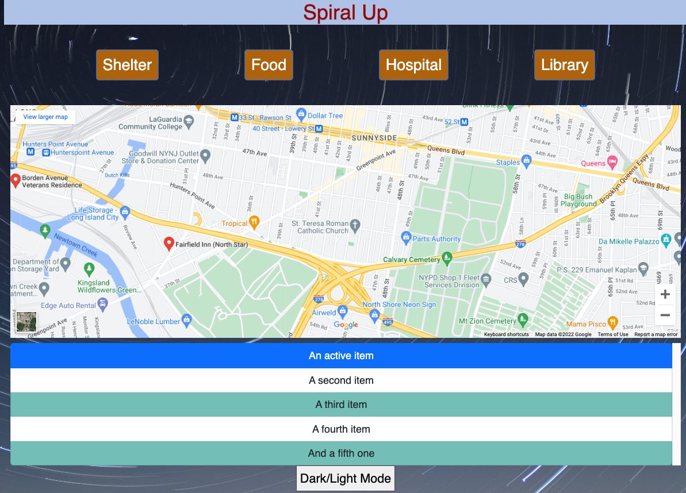

# SpiralUp

Spiral up is an App to help Marginalized and Homeless Individuals find Shelter, Food and Opportunities. Using positive psychology and science to effectively help routines and opportunities for homeless people. We aim to be positive, but rub it against the constraints of reality and provide several pathways to attain the goal of a better future. Hence our slogan to “Spiral-UP” in life’s day to day.

## Dreaming up the app

Below you will see a few back of paper sketches of what where we zeroed-in on what the app would offer.

  &nbsp; 
  &nbsp;
  &nbsp;
  &nbsp;

## And...More designs

We were convinced that we were on the right path, hence we digitized our design.

  &nbsp; 

## MVP (Minimal Viable Product)

We managed to build what we set out to do, but the map features were not very powerful, because we were using an embeded map.

  &nbsp; 

## THE Product

So we decided to take the challenge, and build our map ourselves, with the help of the Google Places API. This enabled us to fully customize how our map would display, and furthermore enabled us to provide our users with accurate searches.

  &nbsp; 

# Please Join our Project

We are a small team of developers who believe that we can do our small part in making this a better world for all. If you would like to contribute to this effort, please feel free to join our project.

---

---

MIT License

Copyright (c) 2022 MarkACodes

Permission is hereby granted, free of charge, to any person obtaining a copy
of this software and associated documentation files (the "Software"), to deal
in the Software without restriction, including without limitation the rights
to use, copy, modify, merge, publish, distribute, sublicense, and/or sell
copies of the Software, and to permit persons to whom the Software is
furnished to do so, subject to the following conditions:

The above copyright notice and this permission notice shall be included in all
copies or substantial portions of the Software.

THE SOFTWARE IS PROVIDED "AS IS", WITHOUT WARRANTY OF ANY KIND, EXPRESS OR
IMPLIED, INCLUDING BUT NOT LIMITED TO THE WARRANTIES OF MERCHANTABILITY,
FITNESS FOR A PARTICULAR PURPOSE AND NONINFRINGEMENT. IN NO EVENT SHALL THE
AUTHORS OR COPYRIGHT HOLDERS BE LIABLE FOR ANY CLAIM, DAMAGES OR OTHER
LIABILITY, WHETHER IN AN ACTION OF CONTRACT, TORT OR OTHERWISE, ARISING FROM,
OUT OF OR IN CONNECTION WITH THE SOFTWARE OR THE USE OR OTHER DEALINGS IN THE
SOFTWARE.

---

---
